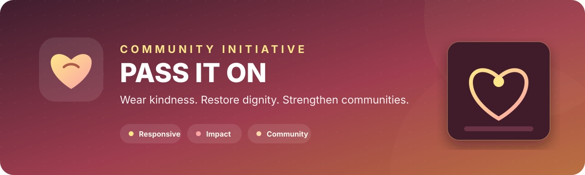

<p align="center">
  
</p>

<p align="center">
  <a href="https://nuru999.github.io/PASS-IT-ON/"></a>
  
  
  
</p>

## Overview

**PASS IT ON** is a responsive website for a Kenyan social initiative that connects gently used clothing with communities that need it.

The site explains the initiative, presents its intended impact, highlights events and stories, and gives visitors clear ways to donate, volunteer, partner, or make contact.

> **Live website:** [nuru999.github.io/PASS-IT-ON](https://nuru999.github.io/PASS-IT-ON/)

## Website sections

| Section | Purpose |
| --- | --- |
| **What We Do** | Explain the clothing-donation mission and process |
| **Impact** | Present the communities and outcomes the initiative aims to support |
| **Events** | Promote drives, outreach activities, and community participation |
| **Stories** | Share updates and human-centred initiative content |
| **Get Involved** | Guide donors, volunteers, and partners |
| **Contact** | Provide direct communication channels |

## Experience and design

- Responsive layout for mobile, tablet, and desktop.
- Clear donation and participation calls to action.
- Warm visual identity focused on dignity and community.
- Smooth section navigation and interactive page elements.
- Reusable sections for future campaigns, events, and impact stories.
- Lightweight static hosting through GitHub Pages.

## Technology

| Layer | Implementation |
| --- | --- |
| **Structure** | Semantic HTML5 |
| **Styling** | Custom CSS, responsive layouts, and transitions |
| **Interaction** | Vanilla JavaScript |
| **Hosting** | GitHub Pages |

## Project structure

```text
PASS-IT-ON/
├── Pass-it-on/
│   ├── pass-it-on.html
│   ├── style.css
│   ├── script.js
│   └── pass-it-on-logo.jpeg
├── assets/
│   └── pass-it-on-banner.svg
└── README.md
```

## Run locally

```bash
git clone https://github.com/nuru999/PASS-IT-ON.git
cd PASS-IT-ON/Pass-it-on
python -m http.server 8000
```

Open [http://localhost:8000/pass-it-on.html](http://localhost:8000/pass-it-on.html).

## Before accepting real donations

This website currently presents the initiative and its calls to action. Before collecting money, clothing, or personal information through the site:

- Publish verified organization and contact details.
- Add a clear privacy notice and donation policy.
- Use a trusted payment provider rather than collecting payment data directly.
- Separate confirmed impact figures from goals or example content.
- Get consent before publishing beneficiary photographs or personal stories.
- Add secure server-side processing for contact or volunteer forms.

## Recommended improvements

- Add verified donation locations and collection schedules.
- Add an events calendar and completed-project gallery.
- Add a transparent impact-report section.
- Connect forms to a secure backend or trusted form service.
- Add social-sharing metadata and search-engine information.

---

<p align="center">
  Website project developed by <a href="https://github.com/nuru999">Nuru Amudi</a>.
</p>